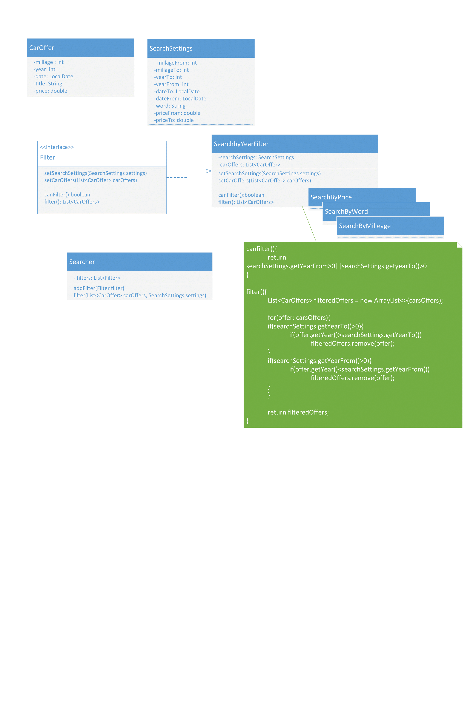

## 🔍 Projekt: Filtrowanie ofert samochodowych

### 🌟 Cel

Zaprojektuj system umożliwiający filtrowanie ogłoszeń sprzedaży samochodów według różnych kryteriów. Klient końcowy powinien móc zawęzić wyniki wyszukiwania za pomocą:

* Zakresu **ceny** (od/do)
* Frazy zawartej w **tytule** ogłoszenia
* Zakresu **daty dodania** ogłoszenia
* Zakresu **rocznika** auta
* Zakresu **przebiegu**

---

### 🧱 Struktura projektu

#### 🚗 `CarOffer`

Gotowa klasa reprezentująca ogłoszenie sprzedaży samochodu. Zawiera pola:

* `price` – cena
* `title` – tytuł ogłoszenia
* `date` – data dodania
* `year` – rocznik
* `milleage` – przebieg

#### ⚙️ `SearchSettings`

Zaprojektuj klasę przechowującą parametry filtrowania (wraz z getterami/setterami):

* `priceFrom`, `priceTo`
* `yearFrom`, `yearTo`
* `milleageFrom`, `milleageTo`
* `dateFrom`, `dateTo`
* `word` – słowo kluczowe

#### 🧩 Filtry

Dla każdego z kryteriów utwórz klasę implementującą interfejs `Filter`:

* `SearchByPriceFilter`
* `SearchByYearFilter`
* `SearchByMillageFilter`
* `SearchByDateFilter`
* `SearchByWordFilter`

Każda z klas powinna:

* implementować interfejs `Filter`, zawierający metody:

  * `setCarOffers(List<CarOffer>)`
  * `setSearchSettings(SearchSettings)`
  * `boolean canFilter()`
  * `List<CarOffer> filter()`
* przefiltrować dane, tylko jeśli `canFilter()` zwraca `true`

#### 🕵️‍♂️ `Searcher`

Zaprojektuj klasę `Searcher`, która będzie zarządzać kolekcją filtrów:

* Metoda `addFilter(Filter)` powinna przyjmować dowolny filtr
* Metoda `filter(List<CarOffer>, SearchSettings)` przekaże dane do każdego filtra i zwróci finalnie przefiltrowaną listę

---

### 🤖 Testy (fragment z `MainProgram.java`)

```java
SearchSettings searchSettings = new SearchSettings();
searchSettings.setDateFrom(LocalDate.now().minusDays(10));
searchSettings.setMilleageTo(200000);
searchSettings.setPriceFrom(10000.0);
searchSettings.setPriceTo(16000.0);
searchSettings.setWord("Sprzedam");
searchSettings.setYearFrom(2000);

Searcher searcher = new Searcher();
searcher.addFilter(new SearchByYearFilter());
searcher.addFilter(new SearchByPriceFilter());
searcher.addFilter(new SearchByMillageFilter());
searcher.addFilter(new SearchByDateFilter());
searcher.addFilter(new SearchByWordFilter());

List<CarOffer> results = searcher.filter(cars, searchSettings);
```

---

### ✅ Efekt końcowy

System powinien umożliwiać dynamiczne i elastyczne filtrowanie listy ogłoszeń, w oparciu o wybrane przez użytkownika kryteria, w sposób zgodny z zasadami programowania obiektowego i stosowaniem interfejsów.



